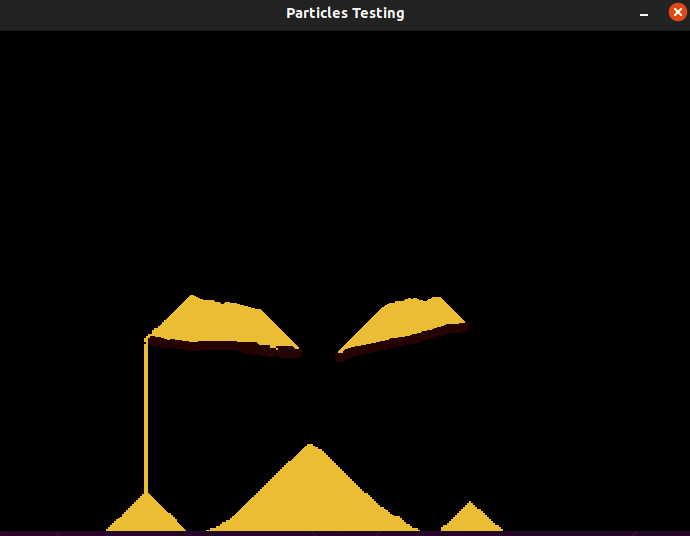
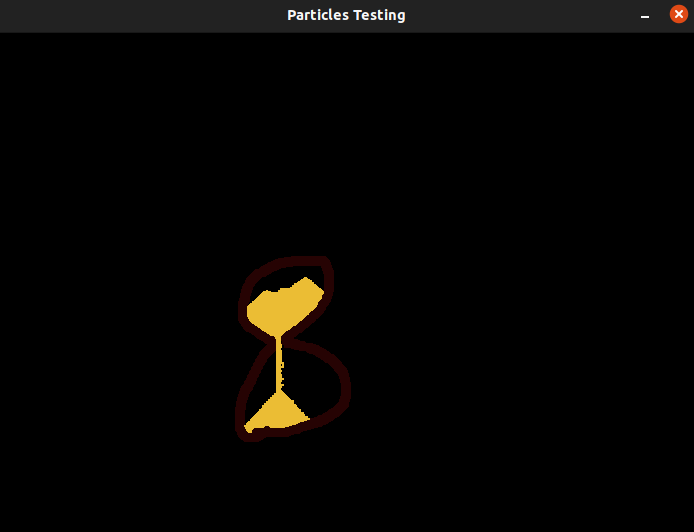

# Particles Test 
[](https://www.repostatus.org/#active) [](https://github.com/LolzDEV/particles_test/actions/workflows/rust.yml)

## :warning: This is a test!
This is not supposed to be a playable game, it's just a test made by me for fun and for trying creating something concrete with the Rust Programming Language

## PRs are welcome
As I said before this is just a test but if you like it and you want to contribute or modify the game, feel free to do it! Isn't this the coolest part of OpenSource?

## Usage

There are a few controls:

- **P**: pauses/unpauses the game
- **R**: resets the world
- **Esc**: closes the game
- **RMB**: erases the particles in the brush area
- **LMB**: spawns selected particle in the brush area
- **1**: selects *sand* as current particle 
- **2**: selects *wood* as current particle 

There are also only 2 types of particles (at the moment):
- **Sand**: This particle is subjected to "real" sand physics
- **Wood**: This particle is just static, it can be used as floor or containment for sand

## Screenshots
### Simple Sand Pyramids

### A wooden working hourglass


## Building
If you want to build this game you need to have the SDL2 library installed in your system.

On Ubuntu:

```sudo apt install libsdl2-dev```

On Fedora:

```sudo dnf install SDL2-devel```

On Arch:

```sudo pacman -S sdl2```

On MacOS (with homebrew)

```brew install sdl2```

```export LIBRARY_PATH="$LIBRARY_PATH:/usr/local/lib"```

On windows:

Installing a library on Windows it's tediuos and I don't want to cover it here also because I don't have a windows machine to try on, so you can google it :)

After installing SDL2 you can just type inside the project folder:

```cargo build```

and you're done! (you need to have cargo and rust installed on your machine)
